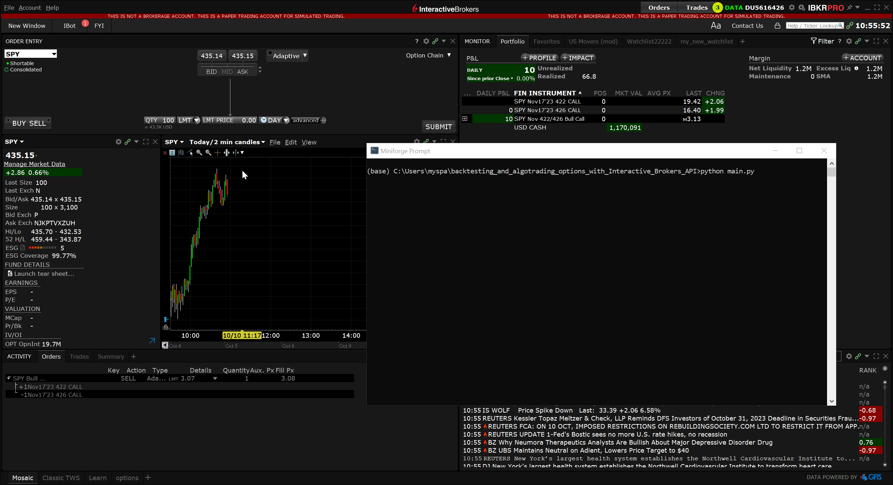

# backtesting_and_algotrading_options_with_Interactive_Brokers_API
this is an example of backtesting and automating options trading strategy with native Interactive Brokers python API (ibapi).
Bot buys call spread on SPY when close price > sma, exits after 5 days or when abrupt downtrend is detected with bayesian change point detection algorithm (BOCD).

## dependencies

* Interactive Brokers account with market data subscriptions
* ibapi package 10.22
* TWS or IB Gateway  
* python 3.9 or later
* pyqstrat

## usage

* start tws and open 'trades' tab
* launch main.py file after market opens 

 
